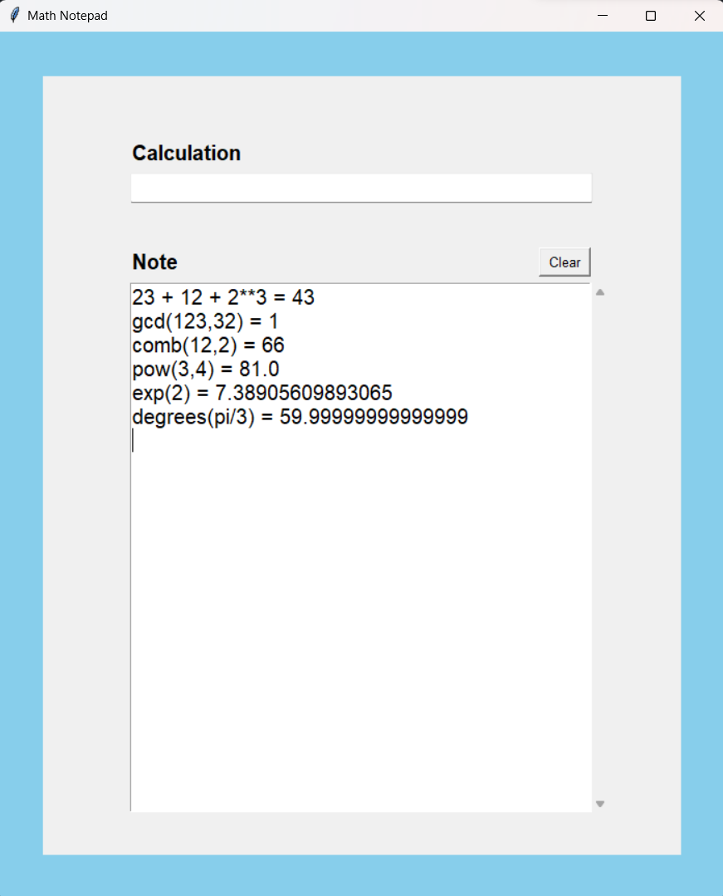

# Math Notebook - Python with Tkinter

## Overview

Welcome to the Math Notebook project! This project aims to provide a user-friendly, interactive, and versatile platform for mathematical exploration and organization. With the power of Python and the Tkinter library, you can create your own digital Math Notebook to perform calculations, visualize data, and solve equations seamlessly.

    

## Features

- **Graphical Interface:** The project offers an intuitive graphical interface built using Tkinter, making it easy to use and navigate.

- **Basic Calculations:** Perform basic mathematical operations like addition, subtraction, multiplication, and division.

- **Advanced Functions:** Access advanced mathematical functions such as trigonometric, logarithmic, and exponential calculations.

- **Plotting:** Visualize data and mathematical functions by creating interactive graphs and plots.

- **Equation Solver:** Solve equations numerically and graphically, helping you understand the solutions graphically.

- **Customization:** Customize your Math Notebook by adding notes, labels, and annotations to your calculations and graphs.

## Prerequisites

- Python 3.x: Make sure you have Python 3.x installed on your system. You can download it from [python.org](https://www.python.org/downloads/).

- Tkinter: Tkinter is included with most Python installations, but if it's not available on your system, you may need to install it separately.

## Getting Started

1. Clone this repository to your local machine using `git clone`.

2. Navigate to the project directory.

3. Run the `math_notebook.py` file to launch the Math Notebook application.